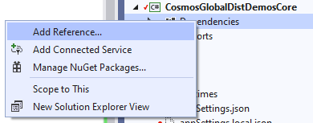
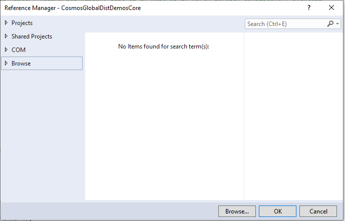
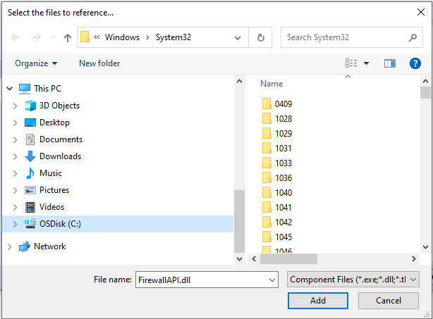
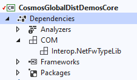

# Cosmos Global Distribution Demos

## Introduction

This solution contains a series of benchmarks that demonstrate various concepts for distributed databases, particularly around 
consistency and latency. The tests in this solution include:

### 1. Read latency between single region and multi-region replicated accounts

This test shows the difference in read latency for an account with a single master in SouthEast Asia region with a front end 
reading from it in West US 2. The next test shows the drastic improvement in latency with data locality when the account is 
replicated to West US 2.

### 2. Write latency for accounts with Eventual consistency vs. Strong consistency + impact of distance on Strong consistency

This test shows the difference in write latency for two accounts with replicas 1000 miles apart in West US 2 and Central US regions,
one with Eventual consistency, the other with Strong consistency. There is a third test that shows the impact on latency when the 
distance between the regions is more than double the distance, demonstrating the speed of light impact on latency when using Strong 
consistency across large distances.

### 3. Read and write latency for Single-Master account versus Multi-Master account

This test shows the difference in read latency for a single-master account (master: East US 2, replica: West US 2) with a client in 
West US 2. The next test shows the impact on write latency when using a multi-master account (master: East US 2, West US 2) with 
a client in West US 2.

### 4. Multi-Master Conflict Resolution

This test generates conflicts and demonstrates conflict resolution for Last Write Wins, Custom Merge Procedure, and "Async" conflict 
resolution modes where conflicts are written to the conflicts feed and then read and resolved.

### 5. Multi-Master Failover

This test conducts a failover in the SDK client in Multi-Master mode by adding a firewall rule in Windows to block the ip address for 
the region being read from. Note: This requires the application runs on Windows 10.

## Provisioning Cosmos DB accounts

This solution requires seven different Cosmos DB accounts. Each of are configured differently to support the underlying test with 
different replication modes, consistency levels and regions.

To deploy the Cosmos DB accounts for this solution, follow the steps below.

### Steps

- Click "Deploy to Azure" below
- Enter a resource group name and location
- Enter a unique string to act as a prefix to make your Cosmos DB accounts unique
- When the script is complete, click on the Outputs tab
- Open the AppSettings.json for the solution on your local machine
- Copy the values for the endpoints and keys from each account to their corresponding placeholder in AppSettings.json

## Provision Windows VM as Host

These tests are designed to run from a Windows VM in West US 2. Due to the Multi-Master Failover Test, this will need to be a Windows 10 VM.
The VM should be configured with a minimum 4 vCPU's and 16 GB of memory with RDP enabled. After the VM has been provisioned, RDP into it 
and install Visual Studio 2019, then copy the solution folder to the VM, or connect VS to your forked repo and clone it locally to the 
VM (with the updated app.config).

To run the demo, RDP into the VM, open the solution folder, launch the solution and press F5.

[!Note]
> You can run this demo from your local machine however the latency benchmarks will be dramatically slower and will not show actual, 
SLA-based Cosmos DB latency metrics.

[!Note]
> You can modify this project to run from different regions but you will first need to modify the ARM template that deploys the Cosmos 
accounts, then modify the AppSettings.json file to match the new regions.

## Configure the project to run the Multi-Master Failover Test

This test requires additional configuration in Visual Studio because it modifies the firewall settings on the Windows VM. Follow the 
steps below to configure this test.

### Add Dependancies

Right click Dependancies and select Add Reference.

### Click Browse

Next click Browse on left hand side and then Browse button on the bottom of the dialog.

### Select FirewallAPI.dll

Type in FirewallAPI.dll into the File Name box, then click Add.

### Confirm Interop.NetFwTypeLib

Finally verify that the Interop.NetFwTypeLib appears in COM folder

## Initializing the Demos

After the accounts are provisioned you can launch the application. Before running any demos you must run the "Initialize" menu item first.
Running Initialize will provision 9 databases and 11 containers. Throughput is set at the container level at 400 RU/s.

[!IMPORTANT]
> This solution has 11 containers provisioned at 400 RU/s each. It is recommended that you run "Initialize" each time you run this 
solution and "Clean up" when you are done which will delete all the databases and containers for this sample. This will reduce your 
costs to zero for Cosmos DB. You may also want to Stop the VM as well if not being used.
